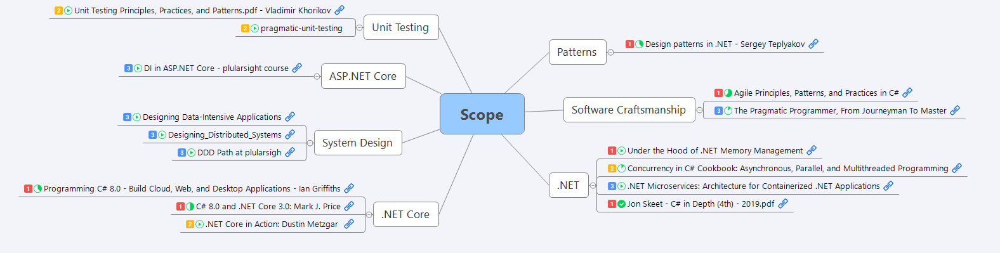

# XMindCSharp [](https://ci.appveyor.com/project/NikiforovAll/xmindcsharp/branch/master) [](https://www.nuget.org/packages/xmindcsharp/) [](https://www.fuget.org/packages/XMindCSharp) [](https://conventionalcommits.org)

XMind API that allows to build .xmind files programmatically

## Install

```bash
dotnet add package XMindCsharp --version X.Y.Z
```

## Getting Started

```csharp
var book = new XMindConfiguration()
                .WithFileWriter("./output", zip: true)
                .CreateWorkBook(workbookName: "test.xmind");
var sheet = book.CreateSheet();
book.AddSheet(sheet, 0); //replaced primary sheet
```

* Example application could be found at: [examples/simple](https://github.com/NikiforovAll/xmindcsharp/tree/master/examples/simple)
* See [XMindAPI.Tests](https://github.com/NikiforovAll/xmindcsharp/tree/master/XMindAPI.Tests)  for more details and examples.

### Example

Here is what you can do with it: 

Full source code could be found at [edu-scope-to-mindmap](https://github.com/NikiforovAll/edu-scope-to-mindmap).

## Running the tests

Run following command from the root folder:

```bash
dotnet test ./XMindAPI.Tests/
```

## Scope

## Contribute

Git Commit Guidelines:

```text
<type>[optional scope]: <description>

[optional body]

[optional footer]
```

#### Type

Must be one of the following:

* **build**: Changes that affect the build system or external dependencies (example scopes: gulp, broccoli, npm)
* **ci**: Changes to our CI configuration files and scripts (example scopes: Circle, BrowserStack, SauceLabs)
* **docs**: Documentation only changes
* **feat**: A new feature
* **fix**: A bug fix
* **perf**: A code change that improves performance
* **refactor**: A code change that neither fixes a bug nor adds a feature
* **style**: Changes that do not affect the meaning of the code (white-space, formatting, missing semi-colons, etc)
* **test**: Adding missing tests or correcting existing tests

### Scope

The following is the list of supported scopes:

* project_infrastructure
* readme
* core_functionality
* [TBD]

## Info

* <https://github.com/xmindltd/xmind/wiki/XMindFileFormat>
* <https://github.com/xmindltd/xmind/wiki/UsingXmindAPI>

## Authors

* **Alexey Nikiforov** - *Initial work*  [NikiforovAll](https://github.com/NikiforovAll)

## License

This project is licensed under the MIT License

## Acknowledgments

* <https://archive.codeplex.com/?p=xmindapi>
